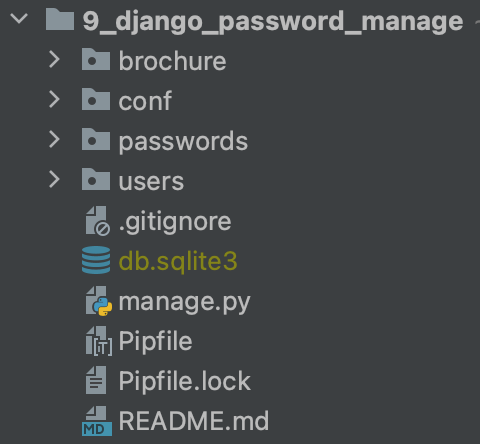
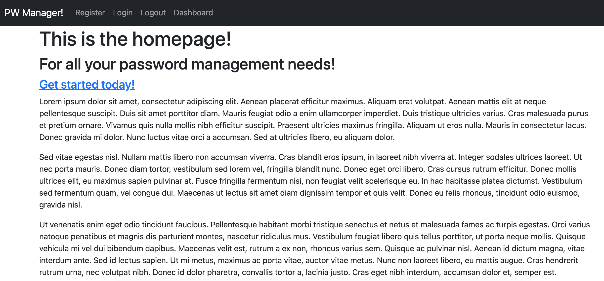
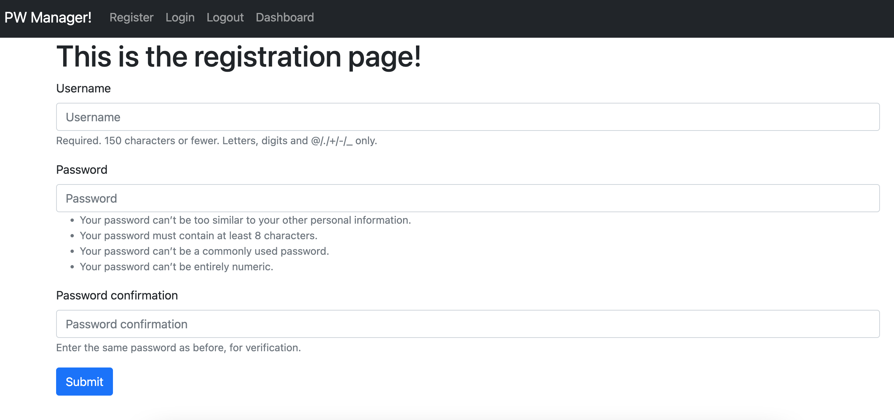
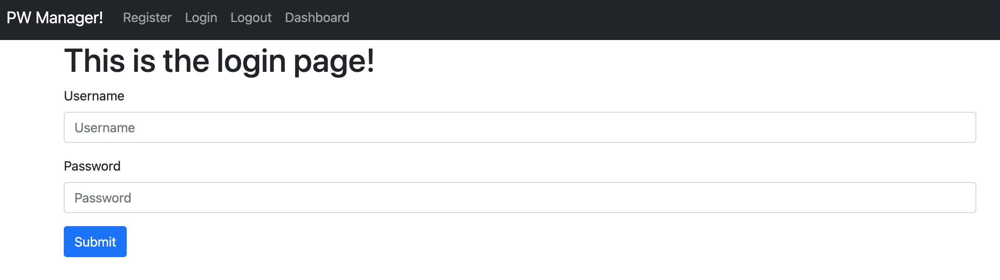
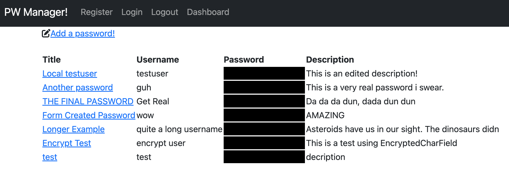
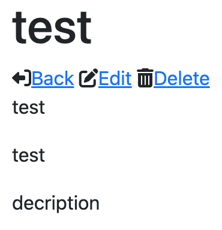
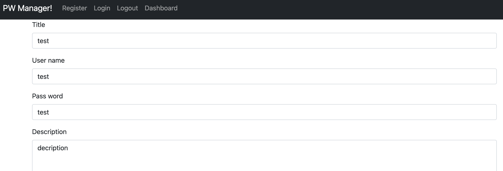

# Django Password Manager
This is a fully customized django web application made from scratch. It is intended to be a password manager with encryption and proper logging in and registration.

## Screenshots

### Project Tree

### Homepage

### Register Screen

### Login Screen

### Dashboard Screen

### Detail View

### Edit View

## Objectives
Create a django project of any type from scratch.

### Learning Objectives
Learn how to use complex features of django in a fully functional web application

After completing this project I know:
 * How to create and configure my own django project
 * How to configure `django.contrib.auth` templates and urls
 * How to create a foriegn key to keep each users data seperate
 * How to use form validation to ensure saftey and correctness of data
 * How to create and use csrf tokens to secure forms
 * How to build a registration form
 * How to build a login form
 * How to handle user data
 * How to determine if a user is logged in or if they need to log in
 * How to encrypt a database and keep data secure

## Technologies Used

 * Python
 * Django
 * Django URLs, Models, Views, Templates, Forms
 * Bootstrap
 * Django Parsley
 * Django User Model
 * Encrypted Model Fields
